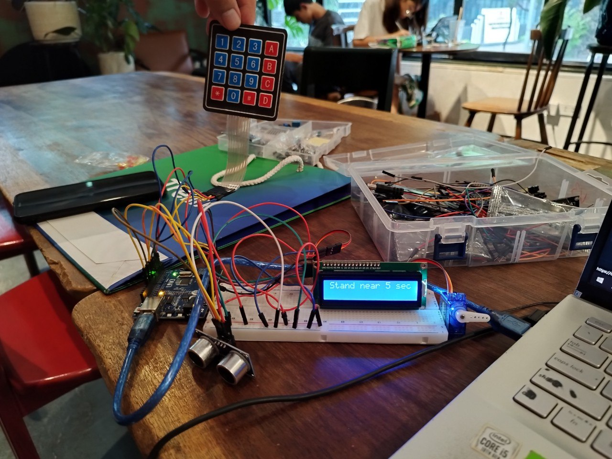
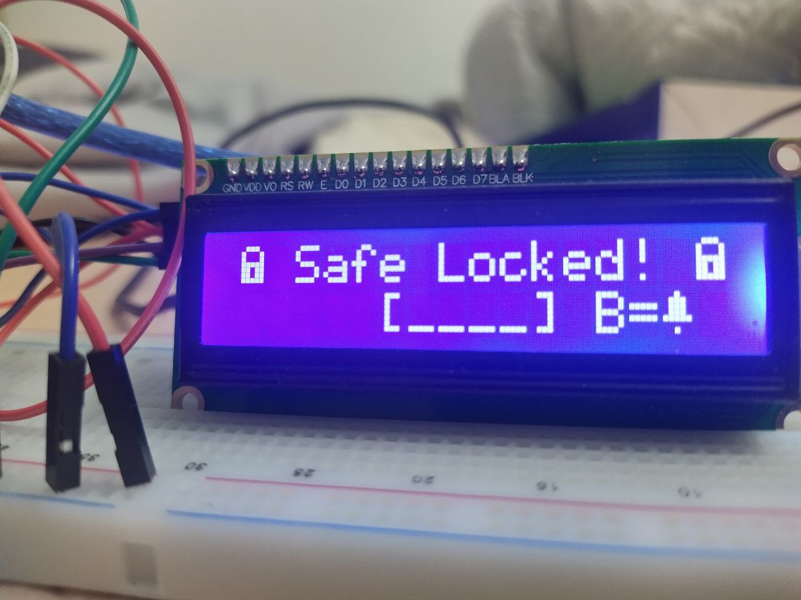
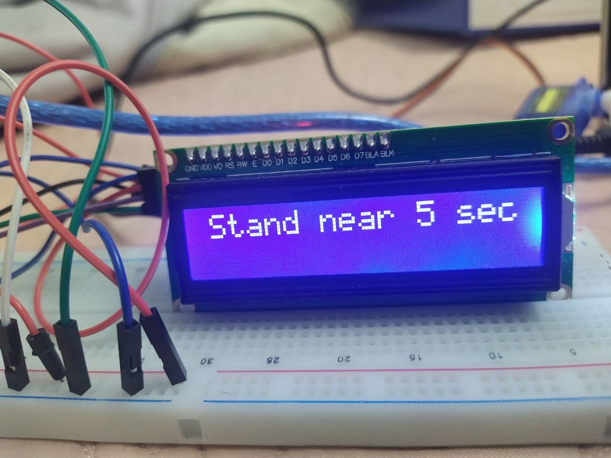
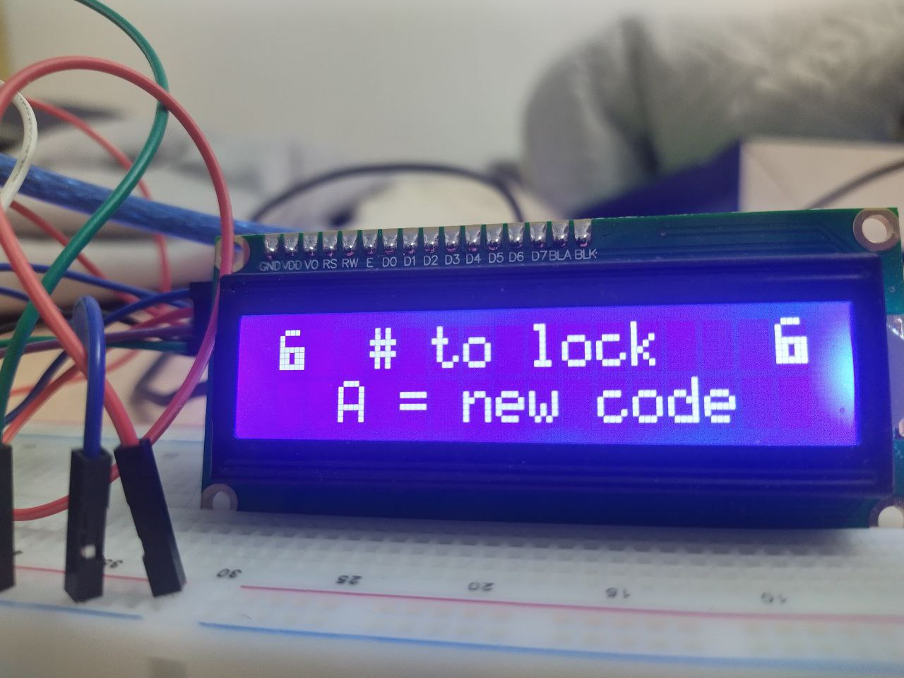
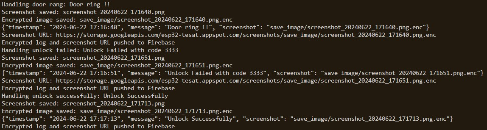
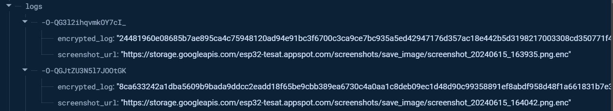
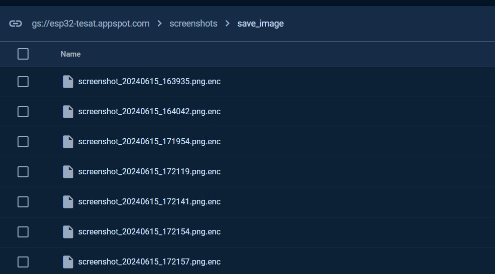
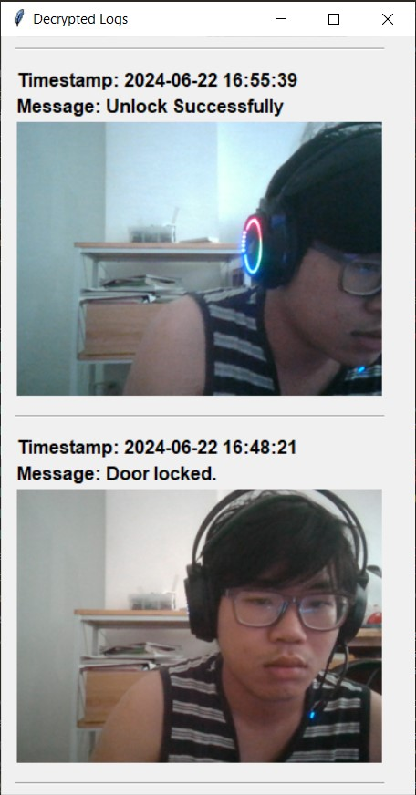

# Arduino USTH Smart Door

### By 
- Nguyễn Đăng Minh - M23.ICT.008
- Nguyễn Huy Hùng - M23.ICT.006



The Arduino-based smart door system enhances home security through a combination of features. It includes keypad entry for secure access, ultrasonic distance measurement enhanced with Kalman Filtering for accurate proximity detection. The system utilizes remote logging via serial communication to an internet-connected laptop, with encrypted data transmission using RSA for logging entries and AES for capturing and securing screenshot images. Additionally, the system integrates Firebase Realtime Database and Firebase Storage for secure data storage and management. A user-friendly interface is provided to decrypt and display the encrypted logs for monitoring and analysis purposes.

## Table of Contents

- [Introduction](#introduction)
- [Features](#features)
- [Hardware Requirements](#hardware-requirements)
- [Software Requirements](#software-requirements)
- [Connections](#connections)
- [Circuit Diagram](#circuit-diagram)
- [Installation](#installation)
- [Usage](#usage)
- [Contributing](#contributing)
- [Demo](#demo)
- [Acknowledgements](#acknowledgements)

## Introduction

The Arduino Smart Door project is designed to create a secure and convenient entry system. The system uses an ultrasonic sensor for proximity detection, a keypad for code entry, and a Liquid Crystal Display (LCD) to show status messages. The system logs events such as door unlocks and lock attempts, sending them via serial communication to a connected computer for logging and monitoring.

## Features
- **Keypad Entry**: Secure access using a 4x4 keypad.
- **Ultrasonic Distance Measurement**: Accurate proximity detection with Kalman Filtering.
- **LCD display** : Display status messages and custom icons
- **Remote Logging**: Logs data via serial communication to an Internet-connected laptop.
- **Servo** : Mimic the door
- **Buzzer** : Custom door ringtone 
- **EEPROM**: the code isn't wiped even when the power goes off.
-  **Serial communication**: Event logging and screenshoting.
- **Encryption**: Uses RSA for logging entries and AES for securing screenshot images.
- **Firebase Integration**: Stores data in Firebase Realtime Database and Firebase Storage.
- **User Interface**: Decrypts and displays encrypted logs.

- Option to forgot your password ?

## Hardware Requirements

- Arduino Uno (or compatible board)
- 4x4 Matrix Keypad
- Servo Motor
- HC-SR04 Ultrasonic Sensor
- I2C LCD Display (16x2)
- Buzzer (optional for audible feedback)
- LEDs (optional for visual feedback)
- Connecting wires and breadboard
- A internet-connected computer with webcam

## Software Requirements

- Arduino IDE
    - LiquidCrystal_I2C (Control an LCD that communicates using the I2C protocol)
    - Keypad (Interface for using a matrix keypad)
    - Servo (Control servo motors)
- Python 3.x (for log monitoring and encryption scripts)
    - OpenCV (for screenshot capturing)
    - PySerial (for serial communication)
    - Cryptography (for encryption and decryption)
    - Firebase Admin Python SDK (for realtime logging and update)

You should also create your own Firebase Realtime Database and Firebase Storage for logging.


## Connections

### Servo Motor
- **SERVO_PIN**: 10

### Ultrasonic Sensor (HC-SR04)
- **Trig Pin**: 8
- **Echo Pin**: 7

### I2C LCD Display
- **SDA**: A4
- **SCL**: A5

### Keypad
- **Row Pins**: 2, 3, 4, 5
- **Column Pins**: A3, A2, A1, A0

### Buzzer
- **Melody Pin**: 12

## Circuit Diagram
```plaintext
Arduino Uno       Servo Motor
------------      ------------
GND ----------- GND
5V ------------ VCC
PIN 10 -------- Signal (SERVO_PIN)

Arduino Uno       HC-SR04 Ultrasonic Sensor
------------      --------------------------
GND ----------- GND
5V ------------ VCC
PIN 8 --------- Trig
PIN 7 --------- Echo

Arduino Uno       I2C LCD Display (16x2)
------------      ------------------------
GND ----------- GND
5V ------------ VCC
A4 ------------ SDA
A5 ------------ SCL

Arduino Uno       4x4 Keypad
------------      -------------
PIN 2 -------- Row 1
PIN 3 -------- Row 2
PIN 4 -------- Row 3
PIN 5 -------- Row 4
A3 ----------- Col 1
A2 ----------- Col 2
A1 ----------- Col 3
A0 ----------- Col 4

Arduino Uno       Buzzer
------------      ------------
GND ----------- GND
PIN 12 -------- Melody Pin
```


## Installation

### Arduino Setup

1. Clone the repository:
    ```bash
    git clone https://github.com/NoodleGodz/Ardunio.git
    cd Ardunio/USTH_Door
    ```

2. Open `USTH_Door.ino` in the Arduino IDE.

3. Installed all the required libraries.

3. Connect your Arduino to your computer and upload the code.

### Python Setup
1. **Install Required Python Libraries**:
    ```bash
    pip install pyserial cryptography opencv-python firebase-admin
    ```

2. **Run the Python Logging Script**:
    ```bash
    python log_monitor.py
    ```

    **Ensure Smooth Operation of the `log_monitor.py` Script**:
    
    - **Disconnect Other Serial Monitors**:
      Make sure all Arduino IDE instances or any other applications that are listening to the serial monitor are disconnected. This ensures the Python script has permission to access the Arduino device.

    - **Update the Serial Port**:
      Change the port in the script to match the corresponding port for your Arduino device:
      ```python
      # Set up serial connection
      ser = serial.Serial('COM6', 9600, timeout=1)  # Adjust 'COM6' to your serial port
      ```

    - **Update Firebase Credentials**:
      Change the Firebase logging certificate to your own:
      ```python
      cred = credentials.Certificate('esp32-tesat-firebase-adminsdk-6e73u-6c8210c35a.json')
      firebase_admin.initialize_app(cred, {
          'databaseURL': 'https://esp32-tesat-default-rtdb.asia-southeast1.firebasedatabase.app/',
          'storageBucket': 'esp32-tesat.appspot.com'
      })
      ```

## Usage

### Keypad Entry

- Enter the correct 4-digit passcode to unlock the door. The default passcode is set up during the first run.
- When the door is locked and proximity is detected, enter any 4-digit code to submit a pass. If correct, the door unlocks. If incorrect, the door will lock down for *20 seconds*. You can also press `B` to ring the doorbell.
- When the door is unlocked, you can lock the door back or change the passcode.


### Proximity Detection

- The ultrasonic sensor detects when someone is near the door and displays a message on the LCD. For better detection, a **Kalman filter** is deployed:

    ```cpp
    class KalmanFilter {
    public:
        KalmanFilter(float process_noise, float sensor_noise, float estimated_error, float initial_value) {
            Q = process_noise;
            R = sensor_noise;
            P = estimated_error;
            X = initial_value;
        }

        float updateEstimate(float measurement) {
            P = P + Q;
            K = P / (P + R);
            X = X + K * (measurement - X);
            P = (1 - K) * P;
            return X;
        }

    private:
        float Q; // Process noise covariance
        float R; // Measurement noise covariance
        float P; // Estimation error covariance
        float K; // Kalman gain
        float X; // Value
    };
    ```

- For a user to be able to enter the passcode, they must be within 30 cm for 5 seconds.

### Changing the Passcode

- To change the passcode, enter a 4-digit code, then reconfirm it. If correct, the password will be changed and logged, encrypted using RSA with `public_key.pem`, into `currentcode.bin`.
- If you forget the password, you can run `forgot_pwd.py` to recover it:
    ```bash
    > The decrypted new code is: 1212
    ```

### Event Logging

- Events such as successful unlocks and locks, failed attempts, ringing the bell, and code changes are logged and encrypted using RSA with `public_key.pem`.
- Screenshots are taken from the webcam and AES encrypted with the password `"USTH"`. Example: `save_image\screenshot_20240622_164649.png.enc`.
- Logs are saved to `encrypted_logs.bin` and captured for each event.


- Text logs are pushed to Firebase Realtime Database at `https://esp32-tesat-default-rtdb.asia-southeast1.firebasedatabase.app/`.


- Images are stored in Firebase Storage at `gs://esp32-tesat.appspot.com`.


### UI Decryption
By running `unlog_ui.py` we can see all the event have been logged in our smart door system.




## License

This project is licensed under the MIT License - see the [LICENSE](LICENSE.txt) file for details.

## Demo


## Acknowledgements

- [Arduino](https://www.arduino.cc/)
- [Python](https://www.python.org/)
- [PySerial](https://pyserial.readthedocs.io/)
- [OpenCV](https://opencv.org/)
- [Cryptography](https://cryptography.io/)
- [Firebase](https://firebase.google.com/)
- [Arduino's external libraries](https://docs.arduino.cc/software/ide-v1/tutorials/installing-libraries/)
- [Wokwi](https://wokwi.com/projects/new/arduino-uno)
- [Buzzer's Mario Tune](https://nshopvn.com/product/buzz-5v/?gad_source=1)
- 
